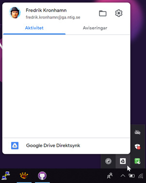
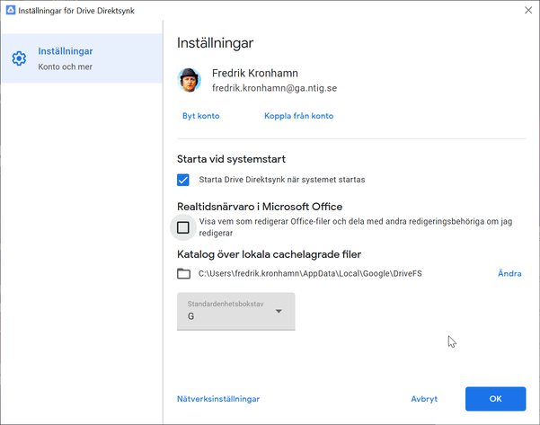

# Nätverksteknik

## Vecka 36 - Säkerhetskopiering: installera och konfigurera Google Drive Sync

&nbsp;  
Kursen nätverksteknik behandlar säkerhetskopiering, huvudsakligen med fokus på servertillämpningar.  
Vi ska dock börja med att installera en desktop-applikation som säkerhetskopierar filer till  
Google Drive.
&nbsp;  
&nbsp;  
&nbsp;  

## 1. Registrera telefonnummer i kontowebben

&nbsp;  
Innan vi börjar installera Google Drive Sync är det bra att ha registrerat sitt mobilnummer  
i Academedias kontowebb. Vissa steg i installationsprocessen kan kräva en så kallad tvåfaktors-  
autentisering (2fa) där en engångskod skickas till din telefon.  
&nbsp;  
&nbsp;  

  

&nbsp;  
&nbsp;  
Börja med att öppna en webbläsare och navigera till [https://konto.academedia.se](https://konto.academedia.se).  
Välj alternativet längst ner **Jag vill registrera eller ändra mina uppgifter för lösenordsåterställning**.
&nbsp;  
&nbsp;  

  
  
&nbsp;  
&nbsp;  
Efter inloggning kan du ange ditt mobilnummer. Innan du kan spara dina uppgifter måste du också  
välja ett par frågor för lösenordsåterställning. Undvik lättgissade svar.
&nbsp;  
&nbsp;  

---
&nbsp;  

## 2. Ladda ner Google Drive klient för Windows
&nbsp;  
&nbsp;  

&nbsp;  
Navigera till [https://www.google.com/intl/sv_se/drive/download](https://www.google.com/intl/sv_se/drive/download) och scrolla ner till
**För privatpersoner**.  
Klicka på **Ladda ned** för att hämta installationsprogrammet **installbackupandsync.exe**.
&nbsp;  
&nbsp;  

---
&nbsp;  

## 3. Starta installationen av Google Drive klient

&nbsp;  
Starta installationen genom att navigera till mappen **Hämta filer** på din dator och dubbelklicka på  
filen **installbackupandsync.exe**,  alternativt starta installationen i webbläsaren genom att klicka  
på den nedladdade filen.
&nbsp;  

&nbsp;  
Installationsprocessen är enkel, man behöver inte välja mellan olika installationsalternativ.  
Klicka på knappen **KOM IGÅNG** för att påbörja konfigurationen av programmet.
&nbsp;  

---
&nbsp;  

## 4. Logga in på ditt Google-konto och ge åtkomst till Drive

&nbsp;  
&nbsp;  
Du ombeds nu logga in på ditt Google-konto. I det här steget kan det vara betydligt enklare att växla till  
en webbläsare och fortsätta konfigurationen. Klicka på **Logga in med webbläsaren istället** som du hittar  
längst ner i fönstret.
&nbsp;  
&nbsp;  

&nbsp;  
&nbsp;  
Om du valt att växla till webbläsaren blir du nu ombedd att välja ett Google-konto för att fortsätta.  
Logga in på kontot om du inte redan är autentiserad.
&nbsp;  
&nbsp;  

&nbsp;  
&nbsp;  
I följande steg godkänner du att klientprogrammet för Google Drive (programmet på din dator) får göra ändringar  
i filerna på din molnlagringsenhet Klicka på **Tillåt**.
&nbsp;  
&nbsp;  

&nbsp;  
&nbsp;  
När du gett åtkomst till applikationen kan du växla tillbaka från webbläsaren till fönstret konfigurationen av programmet.
&nbsp;  
&nbsp;  

---
&nbsp;  

## 5. Välja mappar för synkronisering mot Drive

&nbsp;  

&nbsp;  
Nu ska du mötas av skärmen **Välj mappar på datorn som ska säkerhetskopieras ...** Klicka **Ok**.
&nbsp;  

&nbsp;  
Nu kan du välja mappar som ska synkroniseras. Klicka på **VÄLJ MAPP** och navigera till din hemkatalog.  
Välj mappen **Ruby** som innehåller dina Ruby-filer.
&nbsp;  

&nbsp;  
Notera att mappen du valt blir synlig i listan. Jag valde att klicka ur redan förvalda mappar, eftersom  
jag inte vill säkerhetskopiera dessa. Mappen **Dokument** kan dock vara bra att synka. Låt övriga alternativ  
vara om du inte vill aktivera några ytterligare funktioner. Klicka därefter på knappen **NÄSTA**.
&nbsp;  
&nbsp;  

----
&nbsp;  

## 6. Deaktivera eller aktivera synkronisering från Drive

&nbsp;  

&nbsp;  
&nbsp;  
I nästa steg kan välja om allt innehåll på Drive ska synkroniseras till din dator.
&nbsp;  
&nbsp;  

&nbsp;  
&nbsp;  
Jag har valt att deaktivera detta alternativ eftersom det kan sluka väldigt mycket diskutrymme.  
Klicka slutligen på **STARTA** för att avsluta konfigurationen och låta synkroniseringen påbörjas.
&nbsp;  
&nbsp;  

---

## 7. Inställningar efter avslutad installation

&nbsp;  

&nbsp;  
&nbsp;  
Klicka på det lilla taket (pilen) längst ner till höger i aktivitetsfältet för att visa dolda ikoner.  
Klicka därefter på ikonen **Drive Direktsynk** för att öppna inställningar för applikationen.  
Klicka på kugghjulet för att öppna inställningarna.
&nbsp;  
&nbsp;  

&nbsp;  
&nbsp;  
Här hittar du lite olika typer av inställningar, möjligheter att starta/stoppa synkroniseringen,  
alternativ för att autostarta applikationen vid systemstart osv.  
Under **Nätverksinställningar** kan man även begränsa datatrafiken.
&nbsp;  
&nbsp;  

&nbsp;  
&nbsp;  
Om du klickar på det lilla molnet med en uppåtpil öppnas ett fönster som visar aktiviteten för  
synkroniseringen. Klicka på dom tre punkterna högst upp till höger för att öppna inställningarna  
för vilka mappar som ska synkroniseras osv.
&nbsp;  
&nbsp;  

---

## 8. Dela mapp på Google Drive med andra användare

&nbsp;  
&nbsp;  
Växla nu till din webbläsare och navigera till [https://drive.google.com](https://drive.google.com)  
Notera att det i vänsterpanelen lagts till en enhet som heter **Datorer**  
Allting som synkroniseras från din dator kommer att lagras här.
&nbsp;  
&nbsp;  

&nbsp;  
&nbsp;  
Navigera till mappen Ruby och markera den. Klicka därefter på ikonen för delning.
&nbsp;  
&nbsp;  

&nbsp;  
&nbsp;  
Skriv in mitt användarnamn i dialogen och välj i listan.
&nbsp;  
&nbsp;  

&nbsp;  
&nbsp;  
Klicka slutligen på **Skicka** för att bekräfta delningen av mappen. Nu kan jag ta del av ditt arbete  
i Programmering 1 :-D
&nbsp;  
&nbsp;  

----
&nbsp;  

