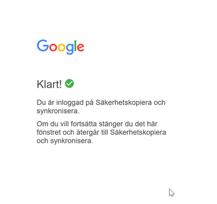

# Nätverksteknik

## Vecka 36 - Installera och konfigurera Google Drive Sync

### Registrera telefonnummer i kontowebben

  Innan vi börjar installera Google Drive Sync är det bra att ha registrerat sitt mobilnummer
  i Academedias kontowebb. Vissa steg i installationsprocessen kan kräva en så kallad tvåfaktors-
  autentisering (2fa) där en engångskod skickas till din telefon.

  

Börja med att öppna en webbläsare och navigera till [https://konto.academedia.se](https://konto.academedia.se). Välj alternativet längst ner
**Jag vill registrera eller ändra mina uppgifter för lösenordsåterställning**.

  

Efter inloggning kan du ange ditt mobilnummer. Innan du kan spara dina uppgifter måste du också välja ett par frågor
för lösenordsåterställning. Undvik lättgissade svar.

